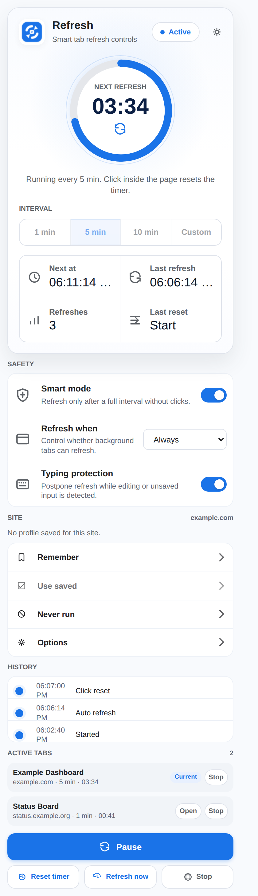
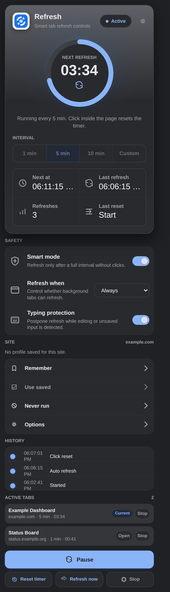
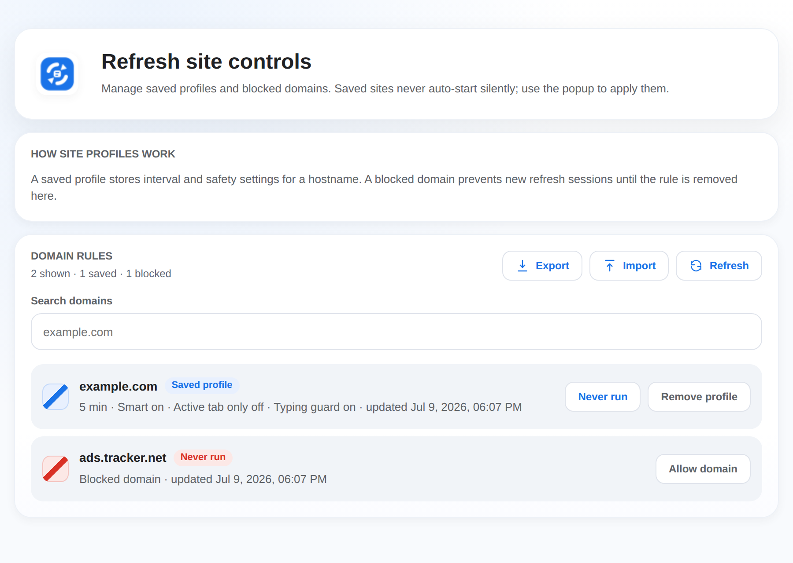
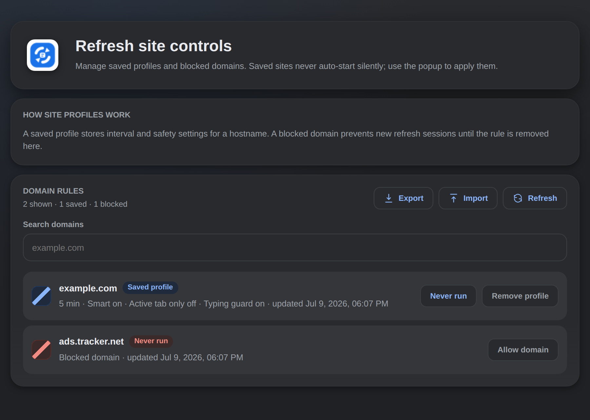

# Refresh

Refresh is a lightweight Chrome extension for controlled auto-refresh on the
current tab. Pick a preset or custom interval, start it from the popup, and the
extension reloads only that tab.

The timer is click-aware: only a real click inside the page resets the
countdown. Opening the tab, switching focus, moving the mouse, scrolling, or
typing without a click does not restart the timer.

## Screenshots

| Popup (light) | Popup (dark) |
| --- | --- |
|  |  |

| Options (light) | Options (dark) |
| --- | --- |
|  |  |

## Features

- Refreshes only the tab where the extension was started.
- Supports fixed intervals: `1 min`, `5 min`, and `10 min`.
- Supports a custom exact interval from `1` to `999` minutes.
- Smart mode refreshes only after a full interval without page clicks.
- Optional active-tab-only mode skips refresh while the tab is inactive.
- Typing protection postpones refresh while editable fields or dirty forms are detected.
- Provides `Pause`, `Resume`, `Reset timer`, `Refresh now`, and `Stop`.
- Shows live countdown with a Material-style progress ring, next refresh time, refresh history, and session stats.
- The countdown ring can also start, pause, or resume refresh without scrolling to the bottom action button.
- Saves site profiles for domains you reuse often.
- Blocks refresh on domains marked as `Never run`.
- Shows an `Active tabs` overview with quick open/stop controls.
- Includes an Options page for managing saved and blocked domains.
- Shows a compact status badge on the extension icon.
- Provides keyboard shortcuts to start/pause/resume and refresh now.
- Exports and imports domain rules as JSON from the Options page.
- Follows the system light/dark theme automatically.
- Available in English and Russian (follows the browser language).
- Uses Manifest V3 with no backend, no external APIs, and no CDN dependencies.
- Includes source SVG plus Chrome PNG icon sizes.

## Install

1. Open `chrome://extensions`.
2. Turn on `Developer mode`.
3. Choose `Load unpacked`.
4. Select this folder.

## Use

1. Open the page you want to refresh.
2. Click the `Refresh` extension icon.
3. Choose `1 min`, `5 min`, `10 min`, or `Custom`.
4. Click `Start refresh`.

## Controls

- `Smart mode` makes clicks inside the page reset the countdown. When it is off,
  clicks are logged but do not move the next refresh time.
- `Refresh when` can keep the original always-refresh behavior or refresh only
  when the tab is active in the focused Chrome window.
- `Typing protection` postpones refresh for 60 seconds while input, textarea,
  select, or contenteditable fields are active or dirty.
- `Pause` stops the countdown without deleting the session.
- `Resume` continues from the saved remaining time.
- The countdown ring mirrors the main `Start refresh` / `Pause` / `Resume`
  action and supports mouse and keyboard activation.
- `Reset timer` restarts the countdown for the full selected interval without
  reloading the page.
- `Refresh now` reloads the tab immediately and schedules the next refresh for
  the full selected interval.
- `Stop` removes the session from the current tab and clears the badge.

## Keyboard Shortcuts

Refresh registers two commands (suggested defaults, editable at
`chrome://extensions/shortcuts`):

- `Alt+Shift+R` — start refresh on the current tab, or pause/resume it if a
  session is already running. Starting this way uses the interval and safety
  settings last chosen in the popup.
- `Alt+Shift+E` — refresh the current tab now (only while a session is running).

## Site Controls

Refresh can remember workspace settings per hostname without starting anything
silently:

- `Remember` saves the current interval and safety settings for the current
  domain.
- `Use saved` applies a saved profile and starts refresh on the current tab.
- `Never run` blocks new refresh sessions on the current domain until the rule
  is removed in Options.
- `Options` opens the domain rules manager.

Saved profiles are prompt-based. Opening a saved domain shows `Saved profile
available`, but the extension waits for you to click `Use saved`.

The Options page can `Export` all domain rules to a JSON file and `Import` them
back (imported rules are validated and merged with the existing ones), which is
handy for backups or moving rules between machines.

## Active Tabs

The popup shows up to four tabs where Refresh is currently running. Each row
shows the title/domain, interval, current status or countdown, plus `Open` and
`Stop` actions. The current tab is marked with `Current`.

## Safe Behavior

Refresh is designed to avoid surprising page reloads during active work:

- Page clicks reset the countdown only when Smart mode is on.
- Mouse movement, scrolling, focus changes, and typing without a click do not
  reset the countdown.
- Typing protection uses edit/dirty state only as a guard. It does not count as
  click activity.
- In active-tab-only mode, skipped refreshes are retried later and can run when
  the tab becomes active again.

## Status And Badge Behavior

The popup shows the next refresh countdown, `Next at`, last refresh time, refresh
count, last reset reason, and a compact event history. History keeps the latest
session events such as start, click reset, manual reset, manual refresh, auto
refresh, pause/resume, inactive skips, typing postpones, and setting changes.

The toolbar badge shows a compact countdown while refresh is active:

- Blue countdown: active.
- Gray `PAU`: paused.
- Orange `SKIP`: skipped because the tab is inactive.
- Orange `WAIT`: postponed because typing or unsaved input is detected.
- Red `!`: blocked/error state.

The badge is driven by a periodic `chrome.alarms` tick rather than a persistent
`setInterval`, so it stays reliable after the Manifest V3 service worker sleeps.
The trade-off is coarser precision: the countdown refreshes roughly every 30
seconds instead of every second.

## Popup UI

The popup uses a product-first Google/Chrome-style Material surface: the header,
countdown ring, interval selector, status text, and session stats live in one
command surface. Secondary controls are quieter grouped rows, while the primary
action remains available in a light sticky action area. The ring follows the
current refresh status: blue for active, gray for paused, orange for skipped or
postponed, and red for errors.

The icon system uses a single Stitch-inspired direction: precise rounded
geometry, one Google-blue accent family, neutral line icons inside the popup,
and a matching extension icon generated from `icons/icon_master.svg`.

## Limitations

Chrome blocks extension scripts on browser system pages such as `chrome://`,
the Chrome Web Store, and other restricted pages. On those pages the extension
shows a blocked status instead of trying to run.

Session stats are stored in `chrome.storage.session`, so they reset when the
browser session ends.

## Localization

The interface is available in English (default) and Russian. Chrome picks the
locale from the browser UI language via `chrome.i18n`, with all strings stored
in `_locales/<lang>/messages.json`. The short toolbar badge codes
(`PAU`, `SKIP`, `WAIT`) stay compact and are not localized.

## Project Structure

```text
manifest.json       Chrome extension manifest
DESIGN.md           Stitch-inspired visual and icon system
tokens.css          Shared design tokens (light + dark palettes)
popup.html          Extension popup markup
popup.css           Popup styling
options.html        Domain rules manager
options.css         Options page styling
src/background.js   Per-tab timer, alarms, reload flow, commands, rule import
src/content.js      Page click detection and safe-input guard state
src/popup.js        Popup state and controls
src/options.js      Saved and blocked domain rules UI, export/import
src/shared.js       Helpers shared by the worker, popup, and options
_locales/           Localized UI strings (en, ru)
docs/screenshots/   README screenshots
icons/              Source SVG and PNG extension icons
test-page.html      Local manual QA page
```

## Development Notes

This project is intentionally build-free. Edit the files directly, reload the
extension from `chrome://extensions`, and test it on a normal web page or local
HTML file.

Render icons from the source SVG, then run the local QA guard before loading or
packaging the extension:

```bash
bash scripts/render_icons.sh
node scripts/qa_extension.js
```
